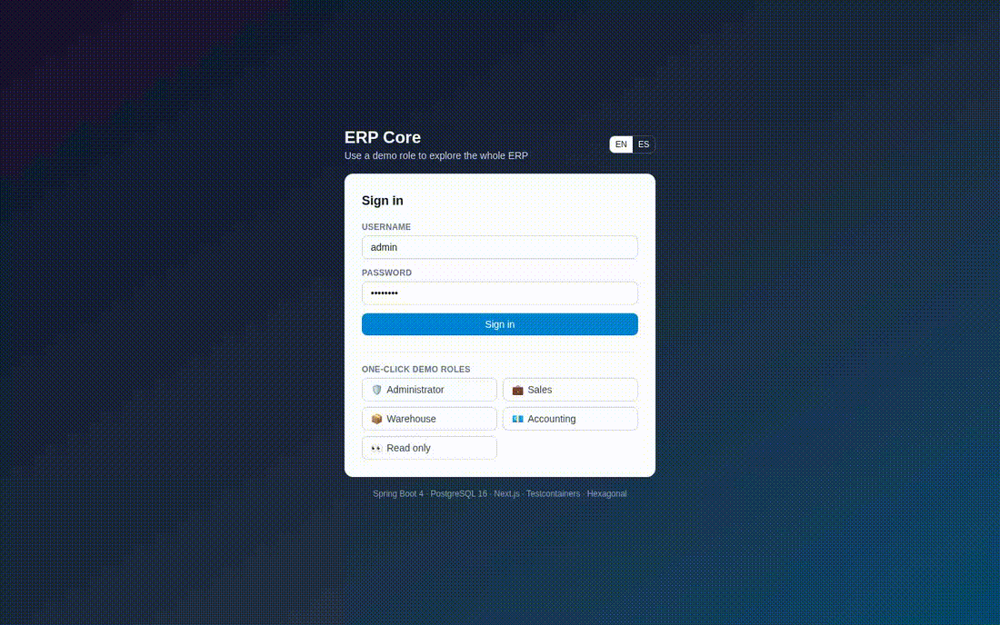

<p align="center">
  
  
  
  
  
  
  
</p>

# ERP Core — Hexagonal ERP Portfolio

**Production-grade backend architecture.** A full ERP (identity/RBAC, catalog, inventory with optimistic locking, sales, purchasing, invoicing with PDF, reports, audit trail) built API-First and 100% Dockerized, plus a Next.js dashboard designed to be explored by recruiters in minutes.

**Arquitectura backend de nivel producción.** Un ERP completo (identidad/RBAC, catálogo, inventario con bloqueo optimista, ventas, compras, facturación con PDF, informes y auditoría) construido API-First y 100% Dockerizado, con un dashboard Next.js pensado para que un reclutador lo pruebe en minutos.



> The GIF above is generated by the Playwright golden-path test (`make e2e` → `scripts/demo-gif.sh`), so it can never go stale.

---

## Demo highlights / Lo que puedes probar

| Feature | Details |
| :--- | :--- |
| 🔐 **One-click demo roles** | Login as Admin / Sales / Warehouse / Accounting / Read-only |
| 📊 **Live dashboard** | KPIs + charts backed by **12 months of seeded business history** |
| 📦 **Inventory concurrency** | `@Version` optimistic locking + retries: the race test proves no overselling |
| 🧾 **Order → Invoice → Payment** | Confirm order (reserves stock) → issue invoice (ships stock) → PDF → partial payments |
| 📈 **Reports** | Sales summary, inventory valuation, receivables aging + CSV export |
| 🕵️ **Audit trail** | JSONB snapshots of every relevant change, with the acting user |
| 🌍 **Bilingual** | Full ES/EN in API errors and UI (cookie/`Accept-Language`) |
| 🧪 **Reset demo** | Button + nightly job restore the seeded dataset |

Demo credentials (also shown on the login screen):

| User | Password | Role |
| :--- | :--- | :--- |
| `admin` | `admin123` | Full access |
| `sales` | `sales123` | Customers, sales orders |
| `warehouse` | `warehouse123` | Catalog, inventory, receiving |
| `accountant` | `accountant123` | Invoicing, payments, reports |
| `viewer` | `viewer123` | Read-only |

> [!IMPORTANT]
> This is a portfolio demo, not a production system: credentials are public and data is reset nightly.

---

## Architecture

```text
src/main/java/com/portfolio/erp
├── domain           # Pure models, exceptions, ports (no framework)
├── application      # Use case services (@Transactional)
├── infrastructure
│   ├── in/web       # REST controllers implementing generated OpenAPI interfaces
│   ├── in/demo      # 12-month demo data seeder
│   └── out          # JPA adapters, MapStruct mappers, security, audit, PDF, reports
└── config           # Security, CORS, i18n, audit (AOP)
```

- **API-First:** `src/main/resources/api/openapi.yaml` is the single source of truth. The build generates the REST interfaces (`openapi-generator` with `useSpringBoot4` + `useJackson3`); controllers implement them.
- **Dependency Rule enforced by ArchUnit:** the domain depends on nothing; the application depends only on the domain; infrastructure depends on both.
- **Concurrency:** inventory uses `@Version` + `@Retryable`; the losing transaction retries and fails with a localized `409`.
- **Observability-ready:** Actuator health probes, structured logging, JaCoCo coverage.

See [docs/architecture.md](docs/architecture.md) for C4/sequence diagrams and [docs/adr](docs/adr) for the decision records.

## Tech stack

Java 21 · Spring Boot 4.1 (Security 7, Hibernate 7, Jackson 3) · PostgreSQL 16 · Flyway · MapStruct · springdoc/OpenAPI 3.1 · JWT (Nimbus) · Testcontainers 2 · ArchUnit · JaCoCo · Next.js 16 (App Router, TanStack Query, Recharts, Tailwind 4) · Docker Compose · GitHub Actions.

---

## Quickstart (everything in Docker)

```bash
git clone <this-repo> && cd SourisERP
cp .env.example .env
make up
```

| Service | URL |
| :--- | :--- |
| Frontend dashboard | http://localhost:3000 |
| Swagger UI (contract) | http://localhost:8080/swagger-ui.html |
| OpenAPI YAML | http://localhost:8080/openapi.yaml |
| Health check | http://localhost:8080/actuator/health |
| pgAdmin | http://localhost:5050 (`admin@example.com` / `admin`) |

No local Java or Node is required — builds and tests also run in containers:

```bash
make test      # backend unit + integration tests (Testcontainers PostgreSQL)
make verify    # tests + JaCoCo coverage report (target/site/jacoco)
make fe-build  # production build of the dashboard
make e2e       # Playwright golden-path test + screenshots
make reset     # reset the demo dataset through the API
```

> Rootless Podman users: set `DOCKER_SOCKET=/run/user/$(id -u)/podman/podman.sock` in `.env`
> and the Makefile will use the Podman socket automatically.

## Testing strategy

We do **not** use H2. Integration tests run against a real, isolated PostgreSQL 16 via **Testcontainers**, applying the real Flyway migrations. Highlights:

- `InventoryIntegrationTest#concurrent_reservations_do_not_oversell_the_last_unit` runs two threads against the last unit and asserts exactly one wins.
- `AuthIntegrationTest` proves JWT login, RBAC and localized error messages.
- `BillingIntegrationTest` walks order → invoice → PDF bytes → partial payments → reports → audit trail.
- `HexagonalArchitectureTest` (ArchUnit) fails the build if the Dependency Rule is broken.
- `DemoIntegrationTest` verifies the seeded 12-month dataset and the reset endpoint.

## Deployment

Two ready-made paths — same Docker images:

- **Render + Neon (recommended, free):** `render.yaml` blueprint (Docker web services) + a free Neon PostgreSQL. Keep the free backend warm with any uptime ping to `/actuator/health`.
- **VPS + Caddy (no cold starts):** `docker compose -f docker-compose.yml -f docker-compose.prod.yml --env-file .env.prod up -d --build`. Caddy provides automatic HTTPS and security headers (`infra/caddy/Caddyfile`). CI publishes images to GHCR.

CI (`ci.yml`) runs backend verification, frontend typecheck/build and Docker image builds. CD (`cd.yml`) publishes images to GHCR and triggers Render hooks or an SSH deploy.

## Project structure

```text
├── docker-compose.yml / docker-compose.prod.yml
├── Dockerfile (backend, multi-stage) · frontend/Dockerfile (Next standalone)
├── Makefile (all workflows) · render.yaml · infra/caddy/
├── src/main/resources/api/openapi.yaml      # API contract (source of truth)
├── src/main/resources/db/migration/*.sql    # Flyway schema + reference data
├── src/main/java/com/portfolio/erp/...      # hexagonal backend
├── src/test/java/com/portfolio/erp/...      # Testcontainers + ArchUnit
├── frontend/                                # Next.js dashboard + Playwright
└── docs/                                    # architecture, ADRs, screenshots
```

## License

Distributed under the MIT License. See [LICENSE](LICENSE).
