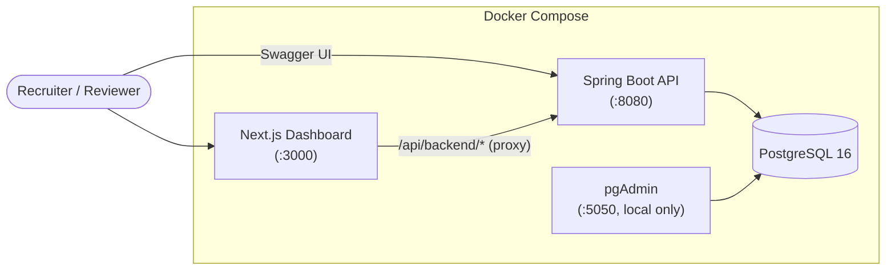
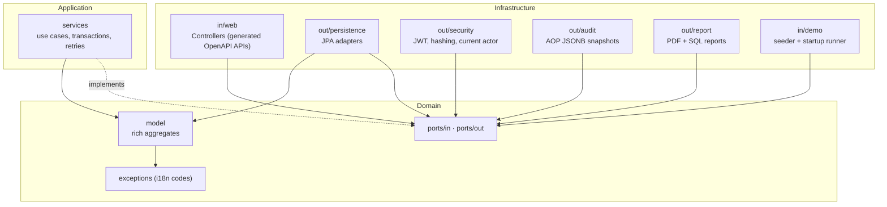
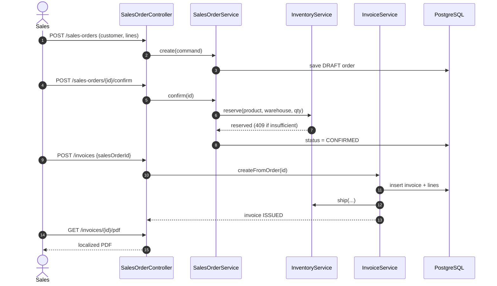
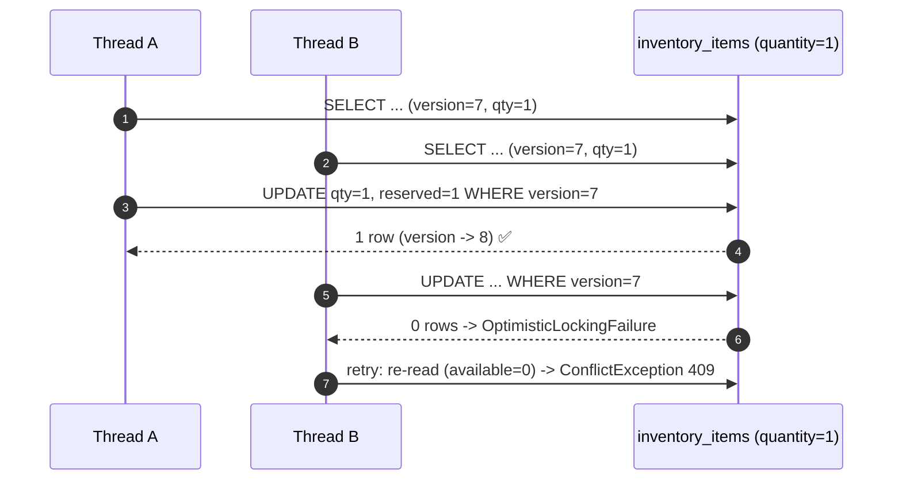
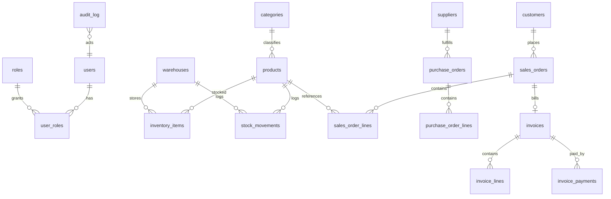

# Architecture

## System context

The browser never talks to the backend directly: the Next.js route handler
`app/api/backend/[...path]` proxies every call and injects the JWT stored in an
httpOnly cookie. This keeps tokens out of JavaScript and removes CORS from the
browser path.

## Hexagonal architecture (dependency rule)

ArchUnit (`HexagonalArchitectureTest`) fails the build if the domain starts
depending on Spring/Jakarta or if the application depends on infrastructure.

## Order-to-cash flow (sales + billing)

## Concurrency strategy (no overselling)

The retry lives *outside* the transaction (`@EnableRetry(order = HIGHEST_PRECEDENCE)`),
so each attempt gets a fresh persistence context.

## Data model (simplified)

All monetary columns are `NUMERIC(12,2)`; `inventory_items`, `products`,
`sales_orders`, `purchase_orders` and `invoices` carry a `version` column driven
by JPA `@Version`.
